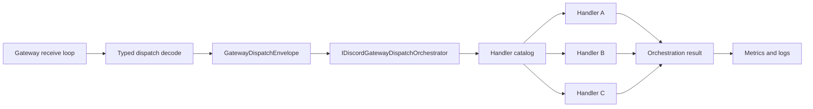

# DiscSharp multi-handler orchestration and interaction pipeline design

## Continuation point

The prior pass created typed gateway dispatch events and typed gateway handlers/subscriptions. The next architectural pressure point is that real Discord apps do not have exactly one handler per event. `MESSAGE_CREATE`, `GUILD_CREATE`, `INTERACTION_CREATE`, voice state changes, and component/modal events all need multiple independent consumers.

This pass introduces a fan-out orchestrator that treats handlers as independent modules. It prevents the gateway receive loop from turning into a fragile call chain where one broken app feature can poison all downstream processing.

## Gateway orchestration flow



## Failure policy

Handlers return a `GatewayHandlerExecutionResult` or throw unexpectedly. Expected failures should be converted by the handler; unexpected exceptions are caught by the orchestrator. Each handler declares a `GatewayHandlerFailurePolicy`:

- `Continue`: log, record metrics, continue with the next handler.
- `StopPipeline`: log, record metrics, stop dispatch for that event.

This is deliberate. A metrics handler, audit handler, or cache-warming handler should not kill application logic. A state mutation handler may need to stop the pipeline when it detects invalid invariants.

## Ordering model

Handlers have an `Order`. Lower values run first. In default `Sequential` mode, handlers execute one by one. In `ParallelByOrderBand` mode, handlers with the same order can run concurrently, while preserving order-band sequencing.

That gives us both determinism and a future high-throughput mode without sacrificing state consistency.

## Interaction pipeline

`INTERACTION_CREATE` deserves a separate pipeline because it has different operational constraints:

- It has a tight acknowledgement window.
- It has different response types.
- It carries component custom IDs, modal custom IDs, slash command data, autocomplete data, and user context.
- Application modules such as Raid Manager and Music Player should not know about gateway lifecycle internals.

The included `InteractionCreateGatewayDispatchHandler<TInteractionCreateEvent>` adapts your existing typed gateway event to `DiscordInteractionEnvelope`, then calls `IDiscordInteractionPipeline`.

## Component custom IDs

The pack uses this compact custom-id shape:

```text
module/action?key=value&key2=value2
```

Examples:

```text
raid/join?raidId=123&role=tank
music/skip?guildId=456
```

The parser validates Discord's 100-character custom ID limit and rejects malformed IDs early.

## App packs

### Raid Manager

The raid module understands actions:

- `join`
- `leave`
- `start`
- `cancel`

It depends on `IRaidManagerInteractionService`, which belongs to application logic. The module only translates interactions into application calls and response plans.

### Music Player

The music module understands actions:

- `play`
- `pause`
- `resume`
- `skip`
- `stop`
- `queue`

It depends on `IMusicPlayerInteractionService`.

## Observability

Metrics included:

- `discsharp.gateway.dispatch.events`
- `discsharp.gateway.dispatch.handlers`
- `discsharp.gateway.dispatch.handler_failures`
- `discsharp.gateway.dispatch.duration_ms`
- `discsharp.interactions.pipeline.executions`
- `discsharp.interactions.pipeline.failures`
- `discsharp.interactions.pipeline.duration_ms`

Activities included:

- `DiscSharp.Gateway.Dispatch`
- `DiscSharp.Interactions.Pipeline`

The code uses `System.Diagnostics.ActivitySource` and `System.Diagnostics.Metrics.Meter`, so OpenTelemetry can subscribe without coupling the library to a specific exporter.
